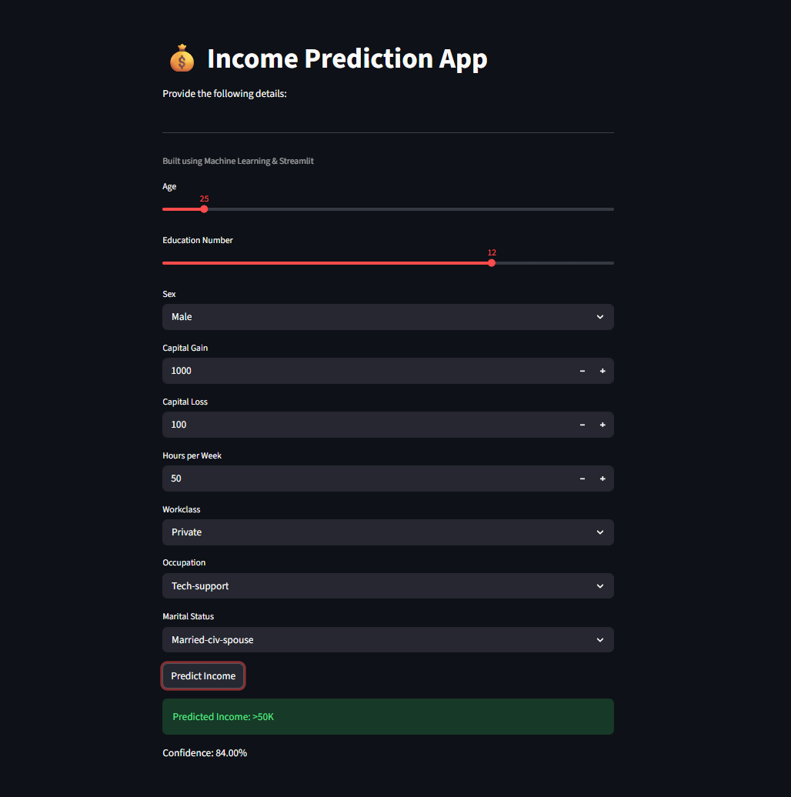

# 💰 Income Prediction - Machine Learning Project

## 📌 Overview
This project is a machine learning based web application that predicts an individual's income category based on input features. The model is trained on structured data and deployed using Streamlit for an interactive experience.

---

## 🧠 Tech Stack
- Python
- Pandas
- NumPy
- Scikit-learn
- Streamlit
- Joblib

---

## 📂 Project Files
- incpred.py → Main application file  
- RF_income.pkl → Trained machine learning model  
- income_scaler.pkl → Feature scaler used for preprocessing  
- income_columns.pkl → Encoded feature columns  
- requirements.txt → Required dependencies  

---

## ▶️ How to Run This Project

### 1. Install dependencies
pip install -r requirements.txt

### 2. Run the application
streamlit run incpred.py

---

## 📸 Project Preview

Here is how the application looks:

---

## 🎯 Model Details
- Algorithm: Random Forest Classifier  
- Data preprocessing: Scaling and encoding applied  
- Output: Income category prediction  

---

## 📌 Note
This project is built for learning purposes and demonstrates end-to-end machine learning deployment using Streamlit.

---

## 👤 Author
Ashil Shaikh
